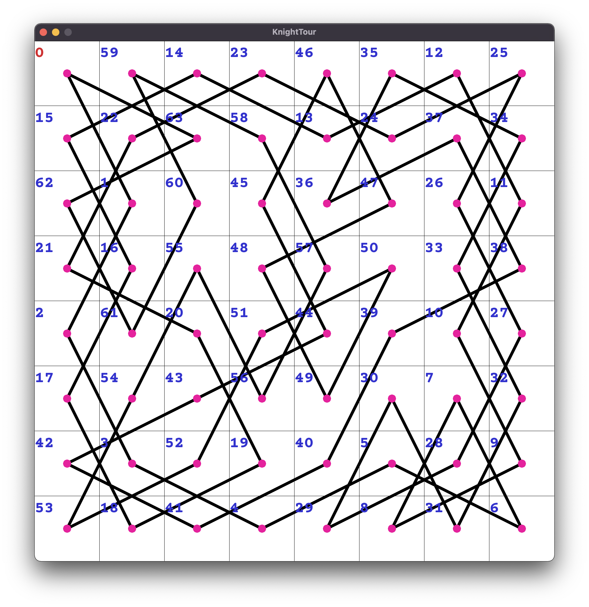

# KnightTour

My implementation of a divide-conquer style algorithm that solves the Knight's
tour problem for square boards of even side length.

The Knight's tour problem questions whether or not a knight can start at any 
square on a n x n chessboard, touch every square exactly once, and return to 
the initial position.

    
    
    
    
    

## Implementation

### Algorithm
The algorithm divides the board into 4 equal or close to equal sections, until
a size small enough to compute the knight's tour in constant time is reached.
In particular, we divide the board until the divided segment size is of size
6 x 6, 6 x 8, 8 x 8, 8 x 10, 10 x 10, or 10 x 12. The knight's tour is then 
computed on each of these divided segments in constant time. We perform a 
search on 4 connected segments to find a path between the first segment to the 
second, third, fourth, and back to the first segment to then connect the 4 
segments together. We keep connecting segments like this until the initial 
board state has a completed knight's tour.

### Justification
The algorithm relies on the fact that any n x n board can be formed by
some combination of 6 x 6, 6 x 8, 8 x 8, 8 x 10, 10 x 10, or 10 x 12 boards. 
A proof is presented [here](KnightTour.pdf). Once each of the base case 
segments contain a completed knight's tour, we select certain vertices along 
the path to join each segment together in clockwise fashion, yielding a larger 
completed knight's tour. As we recurse and keep merging upwards, we simply 
connect larger and larger knight's tours together using the same search process 
between the 4 segments.

### Time and Space
Let k be the number of squares on the board, i.e. k = n x n. We divide 
the board into 4 sections on each recursive call. On each step of the
recursion, we compute O(k) work to perform the search between different 
segments and reconnect the edges to form a complete path. The recurrence 
equation for our algorithm is then
T(k) = 4T(k / 4) + O(k)
which can be evaluated to O(k log k) by the master method.

## Data Structures

### Board
The Grid class stores the order of cells to traverse in the final tour, as well 
as a map from each cell's number to their coordinates on the grid. The Grid 
represents the board that the knight travels on to touch every square once and 
return to its initial position/coordinate.

### Segment
The Segment struct stores data necessary to connect segments together. The 
struct holds the size of the portion of the board it covers, the starting
location on the board, and a list of 4 child Segments comprise the larger 
parent Segment. A map of pairs of numbers is also stored which gives the
information as to selecting a valid path to connect the 4 child Segments.
